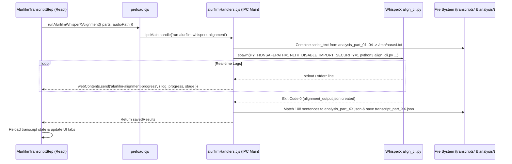

# Design Spec: Alurfilm WhisperX Auto-Alignment & Real-time UI Logs

**Date:** 2026-08-02  
**Feature:** Automatic Voiceover Audio Alignment using WhisperX CLI with Real-Time UI Logs & Automatic Multi-Part Script Mapping.

---

## 1. Overview & Objective

User wants a single-click button in the Alurfilm Transcript Step (`AlurfilmTranscriptStep.tsx`) that triggers an automated WhisperX alignment process in the background. As the alignment runs, a real-time progress bar and live terminal log window will inform the user of execution status (loading model, silence detection, alignment, splitting). Once complete, the output is automatically mapped and saved into individual part files (`WV-FILM-XXXX_transcript_part_01.json`, `02.json`, etc.), immediately updating the UI state.

---

## 2. Architecture & Data Flow

---

## 3. Component & IPC Details

### 3.1 Backend IPC Handler (`alurfilmHandlers.cjs`)
- **IPC Name**: `run-alurfilm-whisperx-alignment`
- **Inputs**: `{ contentId, parts, audioPath }`
- **Environment Variables**:
  - `NLTK_DISABLE_IMPORT_SECURITY=1` (fixes NLTK import issue)
  - `PYTHONSAFEPATH=1`
- **Steps**:
  1. Combine `naskah_voiceover.script_text` from all requested `_analysis_part_XX.json` into a temporary text file.
  2. Spawn `whisperx/venv/bin/python3 whisperx/align_cli.py --audio <audioPath> --text <narasiPath> --output <outputPath> --device cpu`.
  3. Parse stdout/stderr lines and send IPC progress event `alurfilm-alignment-progress` to renderer.
  4. Upon successful exit, parse `/tmp/alignment_output.json`.
  5. Perform exact string matching of aligned entries against each part's `script_text`.
  6. Write output files to `input/alurfilm/transcripts/${contentId}_transcript_part_${partNumStr}.json` and `${contentId}_transcript_multipart.json`.
  7. Return status and saved results.

### 3.2 Preload Bridge (`preload.cjs`)
- Expose `runAlurfilmWhisperXAlignment` for invocation.
- Expose `onAlurfilmAlignmentProgress` event listener.

### 3.3 React UI (`AlurfilmTranscriptStep.tsx`)
- **Primary Action Button**: "Auto-Align Voiceover (WhisperX)" added alongside the prompt/import buttons.
- **Log & Progress Modal/Overlay**:
  - Header with current stage badge (e.g. `[1/4] Preparing`, `[2/4] Loading Model`, `[3/4] Aligning Audio`, `[4/4] Mapping Parts`).
  - Animated Progress Bar (0-100%).
  - Dark-themed terminal log container with auto-scroll.
  - Cancel/Close actions.
- **Post-Completion Handling**:
  - Triggers `loadData()` to immediately update UI state and populate transcript rows for all parts.

---

## 4. Error Handling & Edge Cases

1. **Python Script Failure / Non-Zero Exit Code**:
   - Captures stderr and displays error message inside log panel with retry option.
2. **Missing Audio / Analysis Files**:
   - Validates existence of audio file and analysis JSON files before spawning Python.
3. **Unmatched Sentences**:
   - Fallback logic to assign remaining sentences sequentially to the last part if text formatting differs slightly.

---

## 5. Verification Plan

1. **Backend Alignment Execution**:
   - Verify Python process executes cleanly with `NLTK_DISABLE_IMPORT_SECURITY=1`.
2. **IPC Streaming**:
   - Verify logs and progress percentage update smoothly in the UI during alignment.
3. **Auto-Mapping**:
   - Verify generated `WV-FILM-XXXX_transcript_part_XX.json` files contain correct entries and valid timestamps.
4. **UI State Refresh**:
   - Verify that upon completion, all transcript tabs in `AlurfilmTranscriptStep` immediately display the aligned text without requiring manual refresh.
