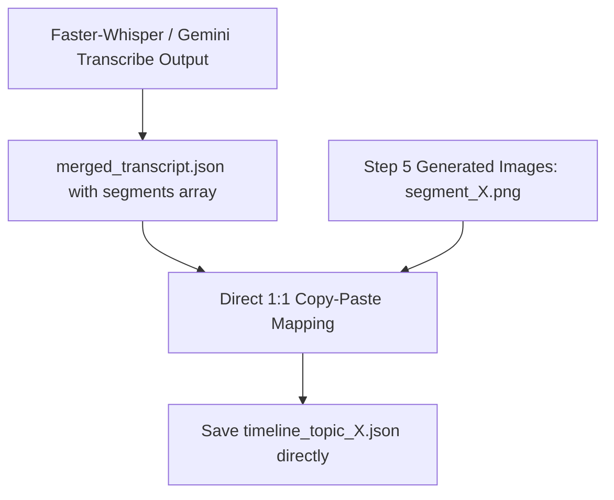

# Design Spec: Direct 1:1 Copy-Paste Transcript Segments to Timeline Clips

Date: 2026-08-05
Status: Approved by User

## Core Requirement
Eliminate all legacy timeline generation, word matching, character proportion estimation, and breakdown interpolation algorithms.
The video timeline (`timeline.json`) must be built strictly by performing a **direct 1:1 copy-paste mapping** of the `segments` array from the transcript output (`merged_transcript_topic_X.json` / Gemini Audio Mapping / Faster-Whisper), attaching only the corresponding image file path for each segment.

## Architecture & Data Flow

### 1. Direct Copy-Paste Logic (`buildTimelineFromTranscript`)
For each item `seg` in `transcript.segments`:
- `clip_id`: `idx + 1`
- `segment_id`: `seg.segment_id || seg.id || idx + 1`
- `quote`: `seg.quote || seg.text || ''`
- `start_sec`: `seg.start_sec !== undefined ? seg.start_sec : seg.start`
- `end_sec`: `seg.end_sec !== undefined ? seg.end_sec : seg.end`
- `duration_sec`: `seg.duration_sec || (end_sec - start_sec)`
- `image_path`: `input/vann/images/topic_X/segment_X.png` (if exists, fallback to `images/segment_X.png`)
- `image_url`: media URL for `image_path`
- `start_frame`: `Math.round(start_sec * 30)`
- `end_frame`: `Math.round(end_sec * 30)`
- `transition`: `'crossfade'`

### 2. Removal of Legacy Fallbacks
- Remove word-matching loops (`firstTargetWord`, `transcriptWords`).
- Remove breakdown segment ratio interpolation (`subTotalChars`, `ratio * gapDuration`).
- Remove complex fallback estimations that produced 200+ second clip duration bugs.

## Affected Files
1. `dashboard/electron/ipc/vannHandlers.cjs` - Simplify `generate-waku-timeline` to use direct copy-paste mapping of transcript segments.
2. `dashboard/src/utils/vannTimelineGenerator.ts` - Simplify frontend timeline generator to use direct copy-paste mapping.
