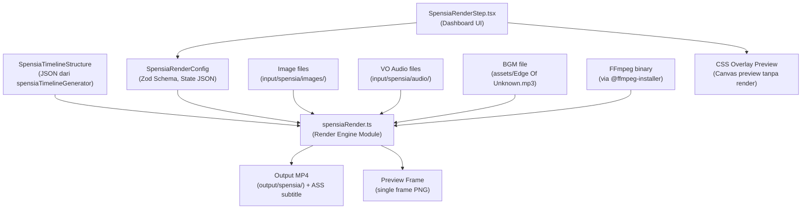

# Rencana: Spensia Render Engine (FFmpeg) & Dashboard Render Step

## Ringkasan

Membangun **`spensiaRender.ts`** — modul render engine berbasis FFmpeg yang dapat di-import langsung oleh Electron main process (bukan CLI spawn seperti `render-alurfilm.ts`). Dilengkapi halaman **`SpensiaRenderStep.tsx`** di dashboard dengan panel konfigurasi lengkap (watermark teks, caption ASS, BGM, vignette) dan preview overlay berbasis state JSON.

**Resolusi target:** 9:16 (1080×1920)

---

## Arsitektur Data Flow



---

## 1. File Baru yang Dibuat

| # | File | Tujuan |
|---|------|--------|
| 1 | `spensiaRender.ts` | Module render engine FFmpeg (root project) |
| 2 | `dashboard/src/components/spensia/SpensiaRenderStep.tsx` | Halaman render di dashboard |
| 3 | `dashboard/src/utils/spensiaRenderConfig.ts` | Zod schema + helper untuk SpensiaRenderConfig |

## 2. File yang Dimodifikasi

| # | File | Perubahan |
|---|------|-----------|
| 4 | `dashboard/electron/main.cjs` | Tambah IPC handler `render-spensia-video` & `render-spensia-preview-frame` |
| 5 | `dashboard/electron/preload.cjs` | Expose API baru ke renderer |
| 6 | `dashboard/src/electron-api.ts` | Tambah tipe TypeScript baru |

---

## 3. SpensiaRenderConfig — Zod Schema

```typescript
// dashboard/src/utils/spensiaRenderConfig.ts

const WatermarkTextConfigSchema = z.object({
  enabled: z.boolean().default(true),
  text: z.string().default('Spensia'),
  fontFamily: z.string().default('Montserrat'),
  fontSize: z.number().min(8).max(120).default(42),
  colorHex: z.string().default('#FFFFFF'),
  opacity: z.number().min(0).max(1).default(0.8),
  position: z.enum(['top-left', 'top-center', 'top-right', 'bottom-left', 'bottom-center', 'bottom-right']).default('bottom-center'),
  offsetX: z.number().default(0),   // pixel offset horizontal
  offsetY: z.number().default(120), // pixel offset vertical dari edge
});

const CaptionConfigSchema = z.object({
  enabled: z.boolean().default(true),
  fontName: z.string().default('Montserrat'),
  fontSize: z.number().default(48),
  activeColorHex: z.string().default('#FDE047'),    // kuning highlight
  inactiveColorHex: z.string().default('#FFFFFF'),   // putih
  outlineColorHex: z.string().default('#000000'),
  outlineWidth: z.number().default(3),
  shadowDistance: z.number().default(2),
  positionY: z.number().default(160),   // margin dari bottom (di atas watermark)
  positionX: z.number().default(40),
  alignment: z.number().default(2),     // ASS alignment: 2=bottom-center
  displayMode: z.enum(['single-word', 'phrase']).default('single-word'),
  timeOffsetSec: z.number().default(0.0),
});

const BgmConfigSchema = z.object({
  enabled: z.boolean().default(true),
  path: z.string().default('assets/Edge Of Unknown.mp3'),
  volume: z.number().min(0).max(1).default(0.15),
  fadeInSec: z.number().min(0).default(1.0),
  fadeOutSec: z.number().min(0).default(2.0),
});

const VignetteConfigSchema = z.object({
  enabled: z.boolean().default(true),
  intensity: z.number().min(0).max(1).default(0.35),
  colorHex: z.string().default('#000000'),
});

const SpensiaRenderConfigSchema = z.object({
  watermark: WatermarkTextConfigSchema.default({}),
  caption: CaptionConfigSchema.default({}),
  bgm: BgmConfigSchema.default({}),
  vignette: VignetteConfigSchema.default({}),
  resolution: z.object({
    width: z.number().default(1080),
    height: z.number().default(1920),
  }).default({}),
  fps: z.number().default(30),
  outputQuality: z.enum(['fast', 'balanced', 'high']).default('balanced'),
});

type SpensiaRenderConfig = z.infer<typeof SpensiaRenderConfigSchema>;
```

---

## 4. spensiaRender.ts — Arsitektur Render Engine

Module ini di-import langsung oleh Electron main process, **bukan** dipanggil via CLI spawn.

```
/home/jovan/project/content-auto/spensiaRender.ts
```

### Fungsi Utama

```typescript
import { SpensiaRenderConfig } from './dashboard/src/utils/spensiaRenderConfig';
import { SpensiaTimelineStructure, TimelineVideoClip, TimelineCaptionItem } from './dashboard/src/utils/spensiaTimelineGenerator';
import { generateAssSubtitles, CaptionStyleOptions } from './dashboard/src/utils/spensiaAssGenerator';

/**
 * Render full Spensia video menggunakan FFmpeg
 */
export async function renderSpensiaVideo(
  config: SpensiaRenderConfig,
  timeline: SpensiaTimelineStructure,
  outputPath: string,
  onProgress?: (pct: number, msg: string) => void
): Promise<void>;

/**
 * Render satu frame preview dengan semua overlay
 */
export async function renderSpensiaPreviewFrame(
  config: SpensiaRenderConfig,
  sampleImagePath: string,
  outputPath: string
): Promise<string>;
```

### Pipeline Render (renderSpensiaVideo)

1. **Validasi input** — cek semua file image, audio, BGM ada
2. **Generate ASS subtitle** — panggil `generateAssSubtitles(timeline.captions, config.caption)`
3. **Buat video per-segment** — untuk setiap `TimelineVideoClip`, buat video clip dari image statis dengan durasi sesuai segment
4. **Generate vignette overlay** — buat PNG vignette via FFmpeg `geq` filter kalau enabled
5. **Generate watermark text** — render via FFmpeg `drawtext` filter
6. **Concat semua segment** — gabung dengan crossfade transition
7. **Overlay ASS subtitle** — `ass` filter FFmpeg
8. **Overlay vignette + watermark text** — final video filter chain
9. **Mix audio** — gabung VO audio tracks + BGM dengan volume/fade
10. **Output final** — encode ke MP4

### Pipeline Preview Frame (renderSpensiaPreviewFrame)

1. Ambil satu sample image
2. Resize ke 1080×1920
3. Overlay vignette
4. Overlay watermark text
5. Output single-frame PNG

---

## 5. SpensiaRenderStep.tsx — Dashboard UI

```
dashboard/src/components/spensia/SpensiaRenderStep.tsx
```

### Layout

```
┌──────────────────────────────────────────────────────┐
│  🎬 Spensia Render Studio (9:16)                     │
│  Step 7 — Final Video Configuration & Export         │
├──────────────────────┬───────────────────────────────┤
│  LEFT (60%)          │  RIGHT (40%)                  │
│                      │                               │
│  [PREVIEW CANVAS]    │  📐 Watermark Text Config     │
│  1080×1920 scaled    │  ┌─────────────────────────┐  │
│  ┌────────────────┐  │  │ [✓] Enabled             │  │
│  │                │  │  │ Text: [Spensia      ]   │  │
│  │  Sample Image  │  │  │ Font Size: [42px]       │  │
│  │  + Vignette    │  │  │ Color: [#FFFFFF]  [■]   │  │
│  │  + Watermark   │  │  │ Opacity: [====●===] 80% │  │
│  │  + Caption     │  │  │ Position: [bottom-center]│  │
│  │                │  │  │ Offset Y: [120px]       │  │
│  └────────────────┘  │  └─────────────────────────┘  │
│                      │                               │
│  [Render All Parts]  │  📝 Caption Config            │
│  [Preview Frame]     │  ┌─────────────────────────┐  │
│                      │  │ Display: single-word     │  │
│  Progress:           │  │ Font: Montserrat 48px    │  │
│  [==========    ] 50%│  │ Active: #FDE047 (kuning) │  │
│                      │  │ Outline: 3px #000        │  │
│                      │  └─────────────────────────┘  │
│                      │                               │
│                      │  🎵 BGM Config                │
│                      │  ┌─────────────────────────┐  │
│                      │  │ [✓] Enabled             │  │
│                      │  │ File: Edge Of Unknown    │  │
│                      │  │ Volume: [=●======] 15%   │  │
│                      │  │ Fade In: 1.0s / Out: 2s  │  │
│                      │  └─────────────────────────┘  │
│                      │                               │
│                      │  🌑 Vignette Config            │
│                      │  ┌─────────────────────────┐  │
│                      │  │ [✓] Enabled             │  │
│                      │  │ Intensity: [===●====] 35%│  │
│                      │  │ Color: #000000           │  │
│                      │  └─────────────────────────┘  │
├──────────────────────┴───────────────────────────────┤
│  Timeline Segments Summary                           │
│  Part 1 (0:00-3:24) — 12 segments, 3:24 durasi      │
│  Part 2 (3:24-6:48) — 14 segments, 3:24 durasi      │
│  Total: 6:48 | BGM: Edge Of Unknown.mp3             │
└──────────────────────────────────────────────────────┘
```

### Preview Canvas

Preview adalah komponen React yang menampilkan:
- Sebuah `<div>` dengan rasio 9:16
- Background: sample image dari segment pertama (via `media://` protocol URL)
- Overlay CSS: vignette (radial-gradient dengan opacity)
- Overlay teks: watermark di posisi yang dipilih
- Overlay teks: caption sample di bawah
- Semua posisi/ukuran/warna sesuai dengan state konfigurasi

Preview **bukan** hasil render FFmpeg — ini CSS overlay murni yang berubah real-time saat user mengubah konfigurasi.

### State JSON

Konfigurasi disimpan ke:
- `localStorage` key `spensia_render_config`
- File project: `input/spensia/spensia_render_config.json` via `api.saveToProject()`

Load saat mount:
```typescript
useEffect(() => {
  // 1. Load from project file
  const saved = await api.readFromProject('input/spensia/spensia_render_config.json');
  if (saved) setConfig(SpensiaRenderConfigSchema.parse(JSON.parse(saved)));
  
  // 2. Load timeline
  const timelineData = await api.readFromProject('input/spensia/spensia_timeline.json');
  if (timelineData) setTimeline(JSON.parse(timelineData));
}, []);
```

### Render Action

Button "Render All Parts" memanggil IPC handler `render-spensia-video`:

```typescript
const handleRender = async () => {
  setRendering(true);
  try {
    const res = await api.renderSpensiaVideo(config, timeline, outputPath);
    // tampilkan hasil
  } catch (err) {
    // tampilkan error
  }
  setRendering(false);
};
```

---

## 6. Electron IPC Integration

### main.cjs — IPC Handlers Baru

```javascript
// Import module render engine
const { renderSpensiaVideo, renderSpensiaPreviewFrame } = require('../spensiaRender.ts');
// Note: perlu ditranspile dulu, atau pakai tsx runtime

ipcMain.handle('render-spensia-video', async (event, { config, timeline, outputPath }) => {
  const resolvedOutput = outputPath || path.join(SPENSIA_OUTPUT_DIR, `spensia_final_${Date.now()}.mp4`);
  
  await renderSpensiaVideo(config, timeline, resolvedOutput, (pct, msg) => {
    if (mainWindow && !mainWindow.isDestroyed()) {
      mainWindow.webContents.send('render-progress', {
        stage: 'spensia-render',
        progress: pct / 100,
        message: msg,
      });
    }
  });
  
  return {
    outputPath: resolvedOutput,
    mediaUrl: mediaUrl(resolvedOutput),
    fileName: path.basename(resolvedOutput),
  };
});

ipcMain.handle('render-spensia-preview-frame', async (event, { config, imagePath }) => {
  const previewPath = path.join(TMP_DIR, `spensia_preview_${Date.now()}.png`);
  const resultPath = await renderSpensiaPreviewFrame(config, imagePath, previewPath);
  return { filePath: resultPath, url: mediaUrl(resultPath) };
});
```

### preload.cjs — Expose API

```javascript
renderSpensiaVideo: (config, timeline, outputPath) =>
  ipcRenderer.invoke('render-spensia-video', { config, timeline, outputPath }),
renderSpensiaPreviewFrame: (config, imagePath) =>
  ipcRenderer.invoke('render-spensia-preview-frame', { config, imagePath }),
```

### electron-api.ts — Type Definitions

```typescript
interface SpensiaRenderConfig { /* ... */ }
interface SpensiaRenderResult {
  outputPath: string;
  mediaUrl: string;
  fileName: string;
}

// Tambah ke ElectronAPI interface:
renderSpensiaVideo: (config: SpensiaRenderConfig, timeline: SpensiaTimelineStructure, outputPath?: string) => Promise<SpensiaRenderResult>;
renderSpensiaPreviewFrame: (config: SpensiaRenderConfig, imagePath: string) => Promise<{ filePath: string; url: string }>;
```

---

## 7. Detail Teknis FFmpeg Pipeline

### Per-Segment Video Clip (dari Static Image)

```
ffmpeg -loop 1 -i segment_X.png -t {duration} -vf "scale=1080:1920:force_original_aspect_ratio=increase,crop=1080:1920,fade=t=in:d=0.3,fade=t=out:d=0.3" -c:v libx264 -preset ultrafast -crf 18 -pix_fmt yuv420p -an segment_X.ts
```

### Vignette Generation

Vignette dibuat sebagai filter chain di final stage, bukan PNG terpisah:

```
geq=r='r(X,Y)':a='0.7*(1-hypot(2*X/W-1, 2*Y/H-1))':g='g(X,Y)':b='b(X,Y)'
```

Atau lebih mudah: gunakan PNG vignette yang di-generate dari `geq` + `alphaextract`, lalu overlay.

Alternatif lebih sederhana (tanpa perlu generate PNG):
```
vignette=PI/4:max_eval=0
```

### Watermark Text (drawtext)

```
drawtext=text='Spensia':fontfile=/path/to/font.ttf:fontsize=42:fontcolor=white@0.8:x=(w-text_w)/2:y=h-text_h-120:shadowcolor=black@0.5:shadowx=2:shadowy=2
```

Catatan: FFmpeg perlu fontfile path. Bisa pakai font system atau bundled font.

### ASS Subtitle Overlay

```
ass=subtitle.ass
```

File `.ass` di-generate oleh `generateAssSubtitles()` dari data captions timeline.

### Audio Mixing

```
[0:a]volume=1.0[vo];
[1:a]volume=0.15,afade=t=in:d=1.0,afade=t=out:st={totalDur-2}:d=2.0,aloop=loop=-1:size=2e+09[bgm];
[vo][bgm]amix=inputs=2:duration=first:dropout_transition=2[aout]
```

---

## 8. Tantangan Teknis & Keputusan

### Tantangan: Font untuk drawtext FFmpeg
- FFmpeg `drawtext` butuh path ke file font `.ttf`
- Solusi: gunakan font system atau bundle font default di `assets/fonts/`
- Untuk preview CSS di UI, cukup gunakan font-family CSS yang sama

### Tantangan: Crossfade antar segment
- Gunakan FFmpeg `xfade` filter saat concat, atau
- Gunakan `fade=in/out` di tiap segment lalu `concat` demuxer
- Opsi 2 lebih sederhana dan reliable

### Tantangan: Durasi sync
- Timeline dari `spensiaTimelineGenerator` sudah menghitung durasi per segment berdasarkan transcript word timestamps
- Durasi total = total durasi VO audio
- BGM di-loop agar sesuai total durasi

### Tantangan: spensiaRender.ts di-import oleh main.cjs
- `main.cjs` adalah CommonJS, `spensiaRender.ts` TypeScript
- Solusi: gunakan `npx tsx` untuk menjalankan, atau buat `spensiaRender.cjs` sebagai wrapper
- Alternatif: tetap gunakan dynamic `require` dengan `esm` interop
- **Keputusan:** Buat `spensiaRender.ts` sebagai ES module yang di-import via `createRequire` + `tsx` runtime, atau gunakan pattern `require(esm)` dengan flag yang sesuai. Karena internal tool, kita bisa gunakan `jiti` atau tetap `tsx`.

**Alternatif praktis:** Buat IPC handler di `main.cjs` yang memanggil fungsi render FFmpeg langsung (seperti yang sudah dilakukan untuk `concat-alurfilm-final-video`), tanpa perlu import module TS. Semua logika FFmpeg ditulis di `main.cjs` IPC handler. Ini menghindari masalah CJS/ESM interop.

---

## 9. Urutan Implementasi

| Prioritas | Task | Dependensi |
|-----------|------|------------|
| 1 | Buat `spensiaRenderConfig.ts` — Zod schema + type exports | — |
| 2 | Buat `spensiaRender.ts` — render engine module | #1 |
| 3 | Tambah IPC handler di `main.cjs` | #2 |
| 4 | Update `preload.cjs` & `electron-api.ts` | #3 |
| 5 | Buat CSS canvas preview component (terpisah) | #1 |
| 6 | Buat panel Watermark Text config | #5 |
| 7 | Buat panel Caption config | #5 |
| 8 | Buat panel BGM config | #5 |
| 9 | Buat panel Vignette config | #5 |
| 10 | Integrasi semua panel ke `SpensiaRenderStep.tsx` | #6,7,8,9 |
| 11 | State JSON save/load | #10 |
| 12 | Render button + progress + output preview | #3, #10 |
